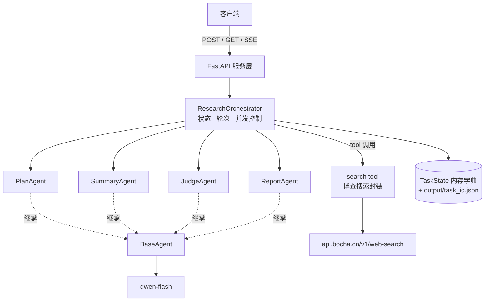
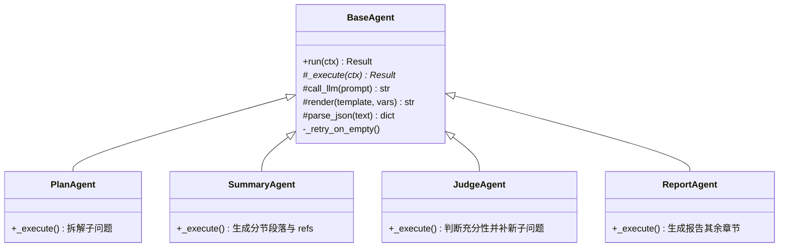

# 深度研究助手 · 需求文档

> 版本：v1.0（Demo）｜阶段：需求与总体技术方案

## 1. 背景与目标

市场 / 产品同学对一个主题做调研（竞品分析、行业趋势、技术选型、政策解读）时，需要人工搜索几十个网页、整理资料、撰写报告，单个主题耗时 2~3 小时，且普遍存在两个问题：**信息覆盖不全**、**结论来源不可追溯**。

本项目要做的是一个「深度研究助手」：输入一个研究主题，由多个 Agent 协作完成**规划 → 多轮检索 → 分节总结 → 充分性判断 → 迭代补检 → 综合成文**，最终产出一份带来源引用与置信度说明的结构化研究报告。它与"一次性问答"的本质区别在于：**先拆题、再检索、检索后自评、不充分则补检**，是一个带反馈回路的迭代过程。

**本期目标**：交付一个可演示的 Demo，走通完整闭环，并把研究过程与可信度显式暴露给使用者。

## 2. 产品定位与交付物

输入：一个研究主题（自然语言）。

输出四项交付物：

1. **结构化研究报告**——摘要、关键结论、分节正文、遗留问题
2. **来源列表**——每条被引用的来源含编号、标题、URL，可追溯
3. **研究过程记录**——每一轮的子问题、检索词、命中数、各 Agent 的执行耗时与轮次
4. **置信度说明**——整体与分节置信度、信息截止时间、无来源结论标注为"模型推断"

## 3. 功能需求

### 3.1 核心流程

```
规划（拆子问题）→ 多轮检索 → 逐子问题总结成节 → 充分性判断
      ↑                                                    │
      └────────── 不充分：生成新子问题，补检（最多 3 轮）──────┘
                              ↓
                        综合生成报告
```

### 3.2 报告结构

固定模板，每节末尾附一行「本节来源：[n][m]」，正文内部不做行内标注：

| 章节 | 内容要求 | 引用 |
|---|---|---|
| `# 研究报告：{主题}` | 标题 | — |
| `## 摘要` | 3~5 句，概括整体结论 | 无 |
| `## 关键结论` | 编号列表，每条是一个可证伪的判断 | 行内 `[n]`，必须标注 |
| `## 分节正文` | 每个子问题一节，由 `SummaryAgent` 生成的完整连贯段落 | 节末「本节来源：[n][m]」 |
| `## 遗留问题` | 本轮研究未解决 / 存在争议的问题 | 无 |
| `## 参考来源` | 只列**被引用过**的来源，编号与 `[n]` 严格一一对应 | — |
| `## 置信度说明` | 整体置信度、信息截止时间、模型推断条目说明 | 无 |

未被引用的检索结果不出现在报告中，只保留在「研究过程记录」里。**报告正文全中文；来源标题与 URL 保留原文不翻译**（翻译会破坏可追溯性）。

## 4. 非功能需求

- **可追溯**：报告中每一个 `[n]` 都能在来源列表中定位到唯一 URL。
- **可观测**：研究全过程通过 SSE 实时推送，任务结束后完整落在 `output/{task_id}.json`。
- **容错**：任一 Agent 失败不导致整个任务失败，必须降级产出部分结果。
- **成本可控**：检索轮次硬上限 3 轮，是唯一的成本边界。
- **Demo 边界**：单进程、内存态、无鉴权、不面向多实例部署，重启即丢失任务状态。

## 5. 总体技术方案

**技术栈**：Python + FastAPI（服务层）；qwen-flash 作为统一 LLM（OpenAI 兼容协议，`base_url` 走环境变量）；博查 Web Search 作为唯一检索源，**直接以返回的 `summary` 字段作为"读到的内容"**，不抓取原始网页正文。

### 5.1 架构



### 5.2 Agent 设计

**`BaseAgent`（基类）** 承担全部共性能力，子类只实现 `_execute()`：

- **LLM 调用**：统一的 qwen-flash 客户端封装
- **空输出自动重试**：返回空串或纯空白时自动重试，最多重试 2 次（共计 3 次尝试）
- **JSON 解析兜底**：剥离 Markdown 代码块围栏、截取首个 `{` / `[` 到末个 `}` / `]` 的内容再解析，仍失败则抛错交由编排器降级
- **提示词模板渲染**：从模板文件渲染，变量注入

**四个任务 Agent**：

| Agent | 输入 | 输出 | 调 LLM |
|---|---|---|---|
| `PlanAgent` | 用户研究主题 | 2~5 个可直接检索的子问题（JSON 数组） | ✅ |
| `SummaryAgent` | 单个子问题 + 该子问题全部来源 | `{section_text, refs}` | ✅ |
| `JudgeAgent` | 主题 + 当前全部分节正文 | `{sufficient, missing_angles, reasons, new_sub_questions}` | ✅ |
| `ReportAgent` | 主题 + 全部分节正文及 refs + 来源清单 | `{summary, conclusions[{text,refs}], open_questions, confidence_note}` | ✅ |



**检索不实现为 Agent**：博查搜索是对外部 HTTP 接口的封装，不含 LLM 推理，作为 `search` **tool** 被编排器直接调用。

**`ResearchOrchestrator`**：普通类而非 Agent，是唯一的状态持有者，负责持有任务状态、控制轮次、并发调度与异常降级。

### 5.3 编排流程

1. `PlanAgent` 拆解主题 → 子问题列表 `Q`
2. 进入第 `r` 轮（`r` 从 1 到 3）：
   1. 对 `Q` 中每个子问题调用 `search` tool（第 1 轮 `count=10`，补检轮 `count=5`），并发上限 2
   2. 每个子问题调用 `SummaryAgent` → `{section_text, refs}`，成为报告的一节
   3. 若 `r < 3`：调用 `JudgeAgent`；判定 `sufficient=true` 则跳出循环；否则以其输出的 `new_sub_questions` 作为下一轮的 `Q`
   4. 若 `r == 3`：**仍然调用** `JudgeAgent`，记录结论但不再循环，直接进入第 3 步
3. `ReportAgent` 生成摘要、关键结论、遗留问题、置信度说明
4. 程序按公式计算置信度并渲染 Markdown

> 第 3 轮依然调用 `JudgeAgent` 是刻意设计：即使不充分也无处可补，但"跑满 3 轮仍不充分"这一结论本身是报告可信度的诚实体现，需写入 `process.judge_history` 并被「置信度说明」引用。

### 5.4 上下文组织

- **按子问题分批**：每次 `SummaryAgent` 调用只喂「一个子问题 + 该子问题的全部来源」，每条 `summary` 截断至 **800 字**
- **综合阶段不喂原始摘要**：`ReportAgent` 的输入只有各分节正文与 refs，绝不把全部原始摘要灌入上下文
- 子问题总数上界为 `4 + 2 × 3 = 10`，报告最长 10 个分节

## 6. 关键机制

### 6.1 轮次与迭代

- **总轮次上限 3 轮**（首轮 + 最多 2 次补检），这是唯一的成本边界，不设 LLM 调用数熔断。
- **规划约束**：`PlanAgent` 提示词硬性要求输出 2~5 个"可直接投入搜索框的名词短语或疑问句"，禁止"背景/意义/概述"类无法检索的元问题，以 JSON 数组返回；程序侧对结果做规范化去重、包含关系合并、超 5 截断、少于 2 个则回退为原主题单问题。
- **充分性判断**：`JudgeAgent` 在**所有子问题都经 `SummaryAgent` 总结完毕之后**运行，审查整体分节正文是否充分——是否覆盖了主题的主要子角度、是否过短或空洞、是否偏差明显、是否存在明显不足的段落。
- **补检**：判定不充分时，`JudgeAgent` 给出 **2~3 个与已检索子问题语义不重复的新子问题**，聚焦缺失的子角度；这些新子问题走"从搜索开始的完整步骤"，并作为**新增分节**进入报告。
- **去重由 LLM 判断**：新子问题是否与已有子问题重复，由 `JudgeAgent` 的提示词约束其按**语义**判断（而非字面重复），**不做程序侧强校验**（见第 8 节）。

### 6.2 置信度公式

按子问题（对应报告分节）计算，全部阈值写成可配置常量（`app/config.py` 的 `CONFIDENCE_*`）：

```
基线 0.30
+ 来源数量   min(来源数, 3) × 0.20            → 最多 +0.60
封顶 0.90，四舍五入到 0.05

分级：≥0.75 高 ｜ 0.50 ~ 0.75 中 ｜ <0.50 低
```

> 当前口径**只按真实来源数量判断**（用户 2026-09-10 决定）。原设计中的域名多样性 / 权威来源 /
> 交叉印证三项暂不参与；要加回来只需改 `app/tools/confidence.py` 的 `_score()` 与对应常量。
> 注意每来源权重因此从 0.10 提到 0.20——否则 3 条来源封顶只有 0.60，「高」永远达不到。

- **整体置信度** = 各分节置信度按来源数量加权平均；无来源的分节权重为 0，自然不参与整体分
- **无检索结果的分节**直接记 `0.00`（低，**不给基线分**，避免"没检索到"看着只比"1 条来源"差一点）
- **信息截止时间** = 检索时刻（`Source` 未携带发布时间）
- **模型推断标注**：无任何 `refs` 的结论一律标注为「模型推断」
- 置信度**数值由程序计算**，`ReportAgent` 只负责用自然语言解释其成因

### 6.3 失败与降级

| 故障 | 处理 |
|---|---|
| 博查返回 0 条 | 用改写后的关键词重试 1 次；仍为 0 → 该子问题标记「未检索到公开资料」，置信度记 0.00，该节如实保留 |
| LLM 超时 / 报错 | 由 `BaseAgent` 统一处理：空输出重试 2 次，指数退避（1s、3s） |
| `PlanAgent` 失败 | 回退为"原主题作为唯一子问题" |
| `SummaryAgent` 失败 | 该节降级为「本节仅保留来源标题与 URL 列表」 |
| `JudgeAgent` 失败 | 视为已充分，直接进入 `ReportAgent` |
| `ReportAgent` 失败 | 将各分节正文直接拼接为降级报告 |
| 未捕获异常 | 任务置 `failed`，但**必须返回已完成的部分结果 + 错误原因**，不能只回错误码 |

### 6.4 状态与并发

- 任务状态存于进程内 `dict[task_id] → TaskState`，同时将完整结果落盘 `output/{task_id}.json`
- 用 `asyncio` + 信号量控制并发：**同时最多 2 个研究任务**，单个任务内的检索/总结批次并发上限同为 2
- 无数据库；服务重启后任务状态丢失

## 7. API 契约

服务基于 FastAPI，全部接口以 `/api/v1` 为前缀。

| 方法 | 路径 | 说明 |
|---|---|---|
| `POST` | `/api/v1/research` | 提交研究主题，创建任务，立即返回 `{task_id}` |
| `GET` | `/api/v1/research/{task_id}` | 查询任务状态（`pending` / `running` / `succeeded` / `failed`）与已完成结果 |
| `GET` | `/api/v1/research/{task_id}/stream` | SSE 推送研究过程事件（规划完成、本轮检索词与命中数、分节完成、判断结论、进入下一轮、综合中、完成） |

任务结果同时提供 Markdown 报告与结构化 JSON 两种形态。产物结构：

```jsonc
{
  "task_id": "...", "topic": "...", "status": "succeeded",
  "report": { "markdown": "...", "sections": [{ "sub_question": "...", "text": "...", "refs": [2,5] }],
              "conclusions": [{ "text": "...", "refs": [1,2] }],
              "sources": [{ "id": 1, "title": "...", "url": "...", "summary": "..." }] },
  "process": { "rounds": 2, "elapsed_ms": 0, "judge_history": [...], "search_queries": [...], "steps": [...] },
  "confidence": { "overall": 0.75, "level": "高", "per_section": [...], "info_cutoff": "...", "unsourced_claims": 0 },
  "error": null
}
```

## 8. 已知局限

1. **子问题去重依赖 LLM**：`JudgeAgent` 是否产出与已有子问题重复的内容，由提示词约束其按语义判断，未做程序侧强校验，可能仍出现语义重复的分节。原设计靠置信度公式里的"域名多样性 / 交叉印证"抵抗重复来源造成的虚高，**该两项已于 2026-09-10 从公式中移除**，因此当前置信度对"重复来源撑高分数"更敏感——同一个页面被多个分节引用时，各分节都会因为它拿到分。
2. **无 LLM 调用熔断**：成本上限仅由 3 轮次控制，单任务的最坏调用次数取决于每轮新增的子问题数。
3. **检索内容仅用搜索 API 摘要**：不抓取网页正文，因此对长文、动态渲染页面的信息覆盖有限。
4. **分节正文无行内引用**：可追溯性落在「关键结论」的行内 `[n]` 与分节的节末来源行上，无法逐句溯源。
5. **单进程内存态**：无数据库、无鉴权，重启丢失任务，不支持多实例部署。

## 9. 验收清单

| # | 验收项 | 判定标准 |
|---|---|---|
| 1 | 端到端可用 | `POST /api/v1/research` 提交一个真实主题，能在 5 分钟内得到 `succeeded` 的完整报告 |
| 2 | 报告结构完整 | 输出 Markdown 含摘要、关键结论、分节正文、遗留问题、参考来源、置信度说明共 6 个章节 |
| 3 | 引用可追溯 | 报告中的每个 `[n]` 都能在来源列表中找到唯一对应 URL；越界编号已被剔除 |
| 4 | 分节来源行 | 每个分节末尾均有一行「本节来源：[n][m]」，且分节正文内不含行内 `[n]` |
| 5 | 迭代真实发生 | `process.search_queries` 中可见第 1 轮检索词，`process.judge_history` 中可见至少一次 `JudgeAgent` 的判定与结论 |
| 6 | 轮次受控 | `process.rounds ≤ 3`；判定充分时提前结束，不空跑 |
| 7 | 置信度可解释 | `confidence.per_section` 每项均可由公式与来源数据复算得到 |
| 8 | 过程可观测 | SSE 连接期间能收到规划、检索、分节、判断、综合各阶段事件 |
| 9 | 降级可用 | 人为令检索返回空 / 令 LLM 报错，任务仍能产出降级结果而非整体失败 |
| 10 | 产物落盘 | 运行后 `output/{task_id}.json` 存在且结构符合第 7 节定义 |
